# Proyecto de entrega: Implementar un pipeline completo de CI/CD (REPOSITORY)


### Instalación rápida

#### Windows 

> Recomendado: usar Docker Desktop con WSL2 activado. Kind funciona mejor si corren dentro de WSL2 o con Docker Desktop habilitado.

```powershell
# 1) Node.js + pnpm
winget install OpenJS.NodeJS.LTS
corepack enable
npm install -g pnpm

# 2) Terraform
winget install Hashicorp.Terraform

# 3) kubectl
winget install Kubernetes.kubectl

# 4) kind
winget install --id Kubernetes.kind -e
```


#### Verificación

```bash
docker --version
terraform version
kind --version
kubectl version --client
node --version
pnpm --version
```

---


## 4. Ejecutar la aplicación localmente

### 4.1 Instalar dependencias

```bash
cd app
corepack enable
pnpm install
```

### 4.2 Ejecutar tests

```bash
cd app
pnpm test
```

### 4.3 Ejecutar app localmente

```bash
cd app
pnpm start
```

Luego abrimos en el navegador:

```text
http://localhost:3000/
```


También podemos probar el health endpoint:

```bash
curl http://localhost:3000/health
```

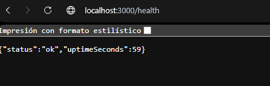

### 4.4 Verificar que responde correctamente

```bash
curl -i http://localhost:3000/
curl -i http://localhost:3000/health
```


---

## 5. Ejecutar con Docker localmente

### 5.1 Construir la imagen

Desde la carpeta `app` del proyecto:

```bash
cd app
docker build -t demo-app:dev .
```


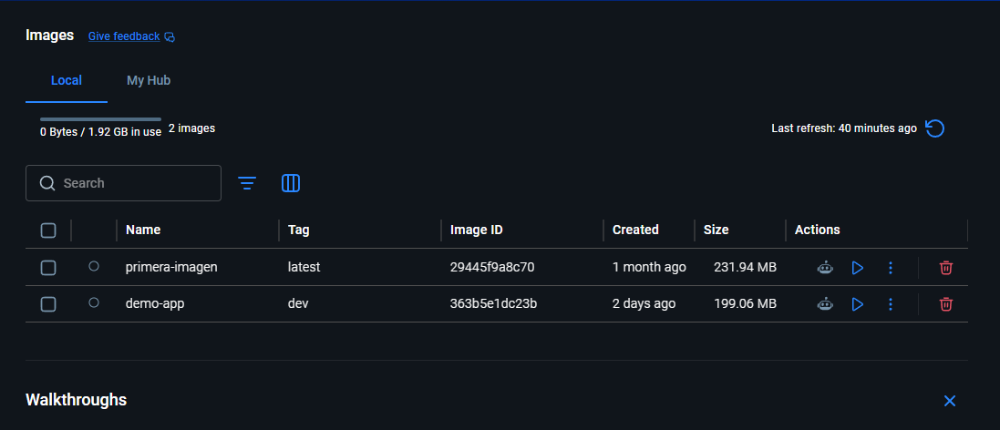

2) Cargarla al cluster Kind

```bash
kind load docker-image demo-app:dev --name demo-cluster
```


### 5.2 Ejecutar el contenedor

```bash
docker run --rm -d -p 3000:3000 --name demo-app demo-app:dev
```


### 5.3 Validar funcionamiento

```bash
curl -i http://localhost:3000/
curl -i http://localhost:3000/health
docker ps
```


### 5.4 Detener el contenedor

```bash
docker stop demo-app
```


---

## 6. Provisionar infraestructura con Terraform (Kind)

La infraestructura se define en:

- [terraform/01-infra/main.tf](terraform/01-infra/main.tf)
- [terraform/01-infra/variables.tf](terraform/01-infra/variables.tf)
- [terraform/01-infra/outputs.tf](terraform/01-infra/outputs.tf)

### 6.1 Inicializar Terraform

```bash
cd terraform/01-infra
terraform init
```


### 6.2 Revisar el plan

```bash
terraform plan
```
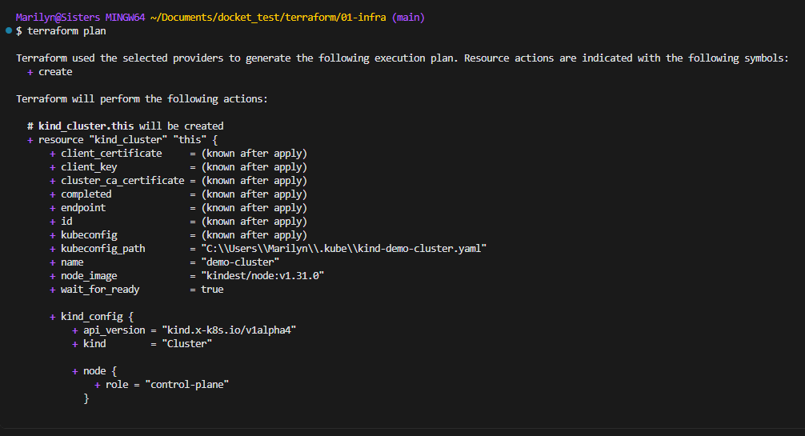

### 6.3 Aplicar la infraestructura

```bash
terraform apply -auto-approve
```
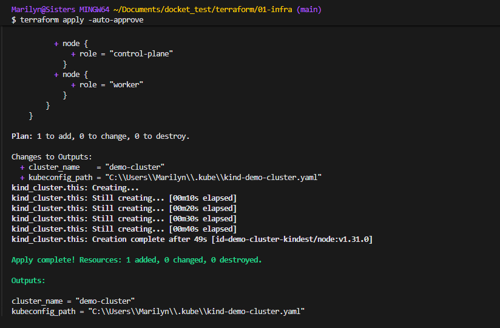
### 6.4 Verificar el cluster

```bash
export KUBECONFIG=$(terraform output -raw kubeconfig_path)
kubectl cluster-info
kubectl get nodes
kubectl get pods -A
```
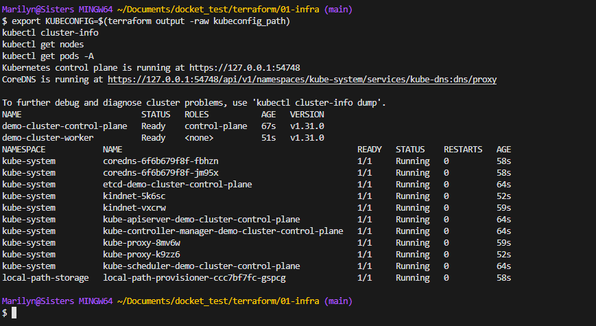

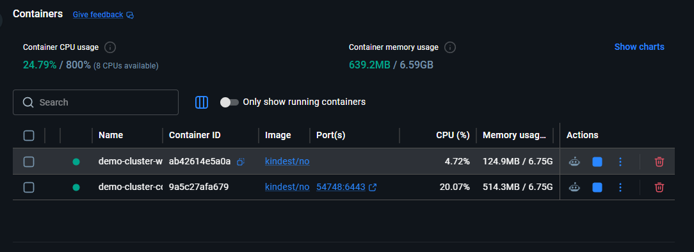
### 6.5 Salida esperada

Debe aparecer un cluster Kind con nodos `control-plane` y `worker`.

---

## 7. Desplegar la aplicación en Kubernetes

Los manifiestos están en:

- [k8s/00-namespace.yaml](k8s/00-namespace.yaml)
- [k8s/01-deployment.yaml](k8s/01-deployment.yaml)
- [k8s/02-service.yaml](k8s/02-service.yaml)
- [k8s/ingress.yaml](k8s/ingress.yaml)
- [k8s/hpa.yaml](k8s/hpa.yaml)

### 7.1 Crear el namespace

```bash
kubectl apply -f k8s/00-namespace.yaml
```
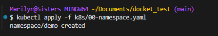

### 7.2 Aplicar Deployment

```bash
kubectl apply -f k8s/01-deployment.yaml
```
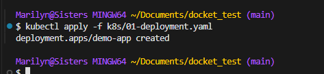

### 7.3 Aplicar Service

```bash
kubectl apply -f k8s/02-service.yaml
```


### 7.4 Aplicar Ingress

```bash
kubectl apply -f k8s/ingress.yaml
```
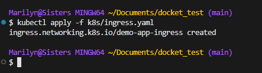

### 7.5 Aplicar HPA

```bash
kubectl apply -f k8s/hpa.yaml
```
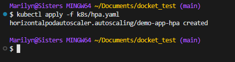

### 7.6 Validar despliegue

```bash
kubectl get namespace
kubectl get deployment -n demo
kubectl get pods -n demo
kubectl get svc -n demo
kubectl get ingress -n demo
kubectl describe hpa demo-app-hpa -n demo
```
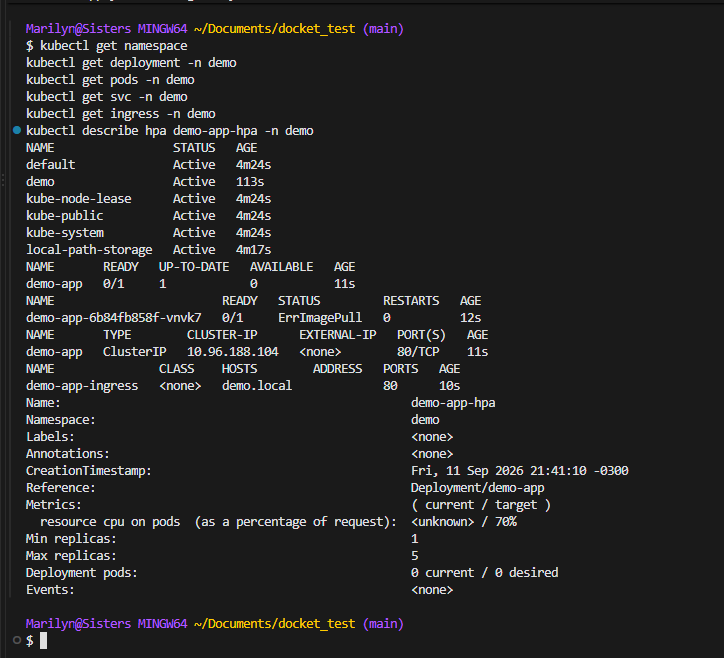

### 7.7 Verificar rollout

```bash
kubectl rollout status deployment/demo-app -n demo --timeout=180s
```


### 7.8 Port-forward para validar la app en local

```bash
kubectl port-forward -n demo svc/demo-app 3000:80
```


Luego probar:

```bash
curl -i http://localhost:3000/
curl -i http://localhost:3000/health
```


---
## 8. GitHub Actions

Los workflows actuales están en:

- [.github/workflows/ci.yml](.github/workflows/ci.yml)
- [.github/workflows/cd.yml](.github/workflows/cd.yml)

### 8.1 Qué hace el pipeline CI

- checkout del repositorio
- setup de Node.js
- instalación de dependencias
- ejecución de tests
- build de la aplicación


### 8.2 Qué hace el pipeline CD

Su propósito es validar que:

- Terraform queda inicializado correctamente
- la infraestructura se puede validar con `terraform validate`
- el formato de Terraform es correcto
- los manifiestos de Kubernetes son válidos con `kubectl apply --dry-run=client`

### 8.3 Ejecutar manualmente el workflow

Desde GitHub:

1. ir a la pestaña Actions
2. seleccionar el workflow `CD` o `CI`
3. hacer click en `Run workflow`
4. confirmar la ejecución

Captura de CI


Captura de CD


---
