# Proyecto de entrega: Implementar un pipeline completo de CI/CD (REPOSITORY)


### Instalación rápida

#### Windows 

> Recomendado: usar Docker Desktop con WSL2 activado. Kind funciona mejor si corren dentro de WSL2 o con Docker Desktop habilitado.

```powershell
# 1) Node.js + pnpm
winget install OpenJS.NodeJS.LTS
corepack enable
npm install -g pnpm

# 2) Docker Desktop + WSL2
# Instalar Docker Desktop desde https://www.docker.com/products/docker-desktop/
# y activar WSL2 si aún no lo tienes

# 3) Terraform
winget install Hashicorp.Terraform

# 4) kubectl
winget install Kubernetes.kubectl

# 5) kind
winget install --id Kubernetes.kind -e

# 6) Helm
winget install Helm.Helm
```

#### Verificación

```bash
docker --version
terraform version
kind --version
kubectl version --client
helm version
node --version
npm --version
pnpm --version
curl --version
```

> Herramientas que se usan en este proyecto: Docker, Node.js, npm/pnpm, Terraform, kubectl, kind, Helm, curl y GitHub Actions.

---


## 4. Ejecutar la aplicación localmente

### 4.1 Instalar dependencias

```bash
cd app
corepack enable
pnpm install
```

### 4.2 Ejecutar tests

```bash
cd app
pnpm test
```

### 4.3 Ejecutar app localmente

```bash
cd app
pnpm start
```

Luego abrimos en el navegador:

```text
http://localhost:3000/
```
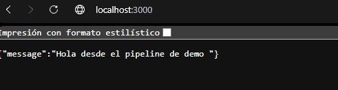

También podemos probar el health endpoint:

```bash
curl http://localhost:3000/health
```


### 4.4 Verificar que responde correctamente

```bash
curl -i http://localhost:3000/
curl -i http://localhost:3000/health
```


---

## 5. Ejecutar con Docker localmente

### 5.1 Construir la imagen

Desde la carpeta `app` del proyecto:

```bash
cd app
docker build -t demo-app:dev .
```
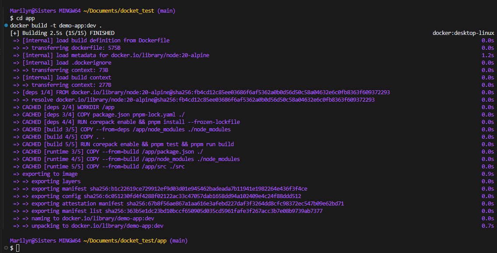


2) Cargarla al cluster Kind

```bash
kind load docker-image demo-app:dev --name demo-cluster
```

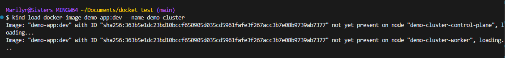

### 5.2 Ejecutar el contenedor

```bash
docker run --rm -d -p 3000:3000 --name demo-app demo-app:dev
```
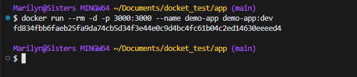

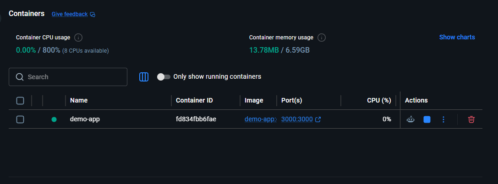

### 5.3 Validar funcionamiento

```bash
curl -i http://localhost:3000/
curl -i http://localhost:3000/health
docker ps
```
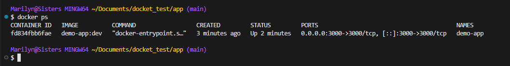

### 5.4 Detener el contenedor

```bash
docker stop demo-app
```


---

## 6. Provisionar infraestructura con Terraform (Kind)

La infraestructura se define en:

- [terraform/01-infra/main.tf](terraform/01-infra/main.tf)
- [terraform/01-infra/variables.tf](terraform/01-infra/variables.tf)
- [terraform/01-infra/outputs.tf](terraform/01-infra/outputs.tf)

### 6.1 Inicializar Terraform

```bash
cd terraform/01-infra
terraform init
```
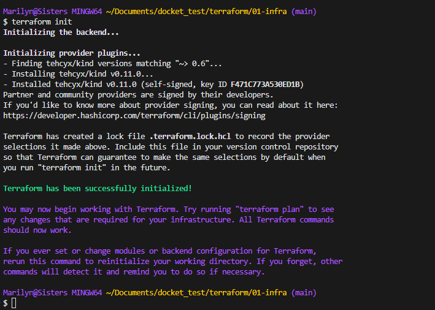


### 6.2 Revisar el plan

```bash
terraform plan
```


### 6.3 Aplicar la infraestructura

```bash
terraform apply -auto-approve
```

### 6.4 Verificar el cluster

```bash
export KUBECONFIG=$(terraform output -raw kubeconfig_path)
kubectl cluster-info
kubectl get nodes
kubectl get pods -A
```


### 6.5 Salida esperada

Debe aparecer un cluster Kind con nodos `control-plane` y `worker`.

---

## 7. Desplegar la aplicación en Kubernetes

Los manifiestos están en:

- [k8s/00-namespace.yaml](k8s/00-namespace.yaml)
- [k8s/01-deployment.yaml](k8s/01-deployment.yaml)
- [k8s/02-service.yaml](k8s/02-service.yaml)
- [k8s/ingress.yaml](k8s/ingress.yaml)
- [k8s/hpa.yaml](k8s/hpa.yaml)

### 7.1 Crear el namespace

```bash
kubectl apply -f k8s/00-namespace.yaml
```


### 7.2 Aplicar Deployment

```bash
kubectl apply -f k8s/01-deployment.yaml
```


### 7.3 Aplicar Service

```bash
kubectl apply -f k8s/02-service.yaml
```
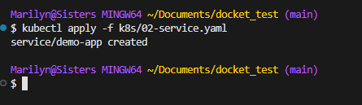

### 7.4 Aplicar Ingress

```bash
kubectl apply -f k8s/ingress.yaml
```


### 7.5 Aplicar HPA

```bash
kubectl apply -f k8s/hpa.yaml
```


### 7.6 Validar despliegue

```bash
kubectl get namespace
kubectl get deployment -n demo
kubectl get pods -n demo
kubectl get svc -n demo
kubectl get ingress -n demo
kubectl describe hpa demo-app-hpa -n demo
```


### 7.7 Verificar rollout

```bash
kubectl rollout status deployment/demo-app -n demo --timeout=180s
```
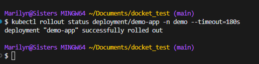

### 7.8 Port-forward para validar la app en local

```bash
kubectl port-forward -n demo svc/demo-app 3000:80
```
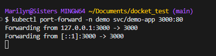

Luego probar:

```bash
curl -i http://localhost:3000/
curl -i http://localhost:3000/health
```
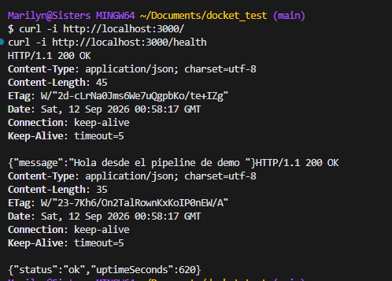


---
## 8. Monitoreo con Prometheus y Grafana

La aplicación ya quedó instrumentada con métricas de Prometheus y expone el endpoint `/metrics`, que es el punto de entrada que Prometheus usa para recolectar datos del servicio.

### 8.1 Instrumentación incluida

Se agregó la dependencia `prom-client` y el middleware de métricas en:

- [app/package.json](app/package.json)
- [app/src/app.js](app/src/app.js)

Esto habilita:

- contador de peticiones HTTP: `demo_app_http_requests_total`
- histograma de latencia: `demo_app_http_request_duration_seconds`
- métricas por defecto de Node.js (`nodejs_*`)
- endpoint `/metrics`

### 8.2 Verificar localmente

```bash
cd app
npm install
node src/index.js
curl http://localhost:3000/metrics
```
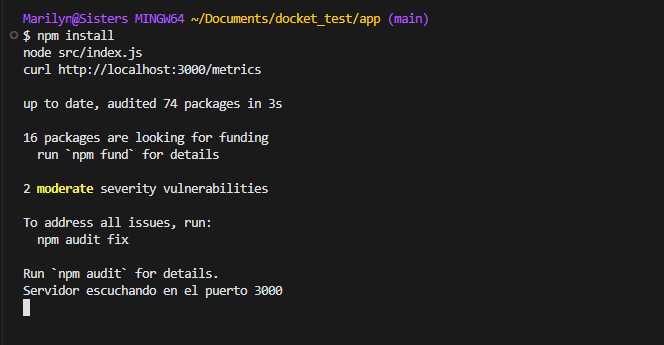


Para generar tráfico y poblar los paneles del dashboard, ejecutá:

```bash
for i in $(seq 1 30); do
  curl -s http://localhost:8081/ >/dev/null
  curl -s http://localhost:8081/demo >/dev/null
  curl -s http://localhost:8081/health >/dev/null
  sleep 1
done
```

Esto dispara peticiones a `/`, `/demo` y `/health` para que Prometheus recolecte métricas y Grafana deje de mostrar `No data`.

### 8.3 Configurar Prometheus y Grafana en Kubernetes

Los manifiestos están listos en:

- [k8s/monitoring/prometheus-values.yaml](k8s/monitoring/prometheus-values.yaml)
- [k8s/monitoring/servicemonitor.yaml](k8s/monitoring/servicemonitor.yaml)
- [k8s/monitoring/grafana-dashboard-app.json](k8s/monitoring/grafana-dashboard-app.json)


#### Instalar stack de monitoreo

```bash
helm repo add prometheus-community https://prometheus-community.github.io/helm-charts
helm repo update
helm upgrade --install kube-prometheus-stack prometheus-community/kube-prometheus-stack \
  -n monitoring --create-namespace \
  -f k8s/monitoring/prometheus-values.yaml \
  --wait --timeout 5m
```
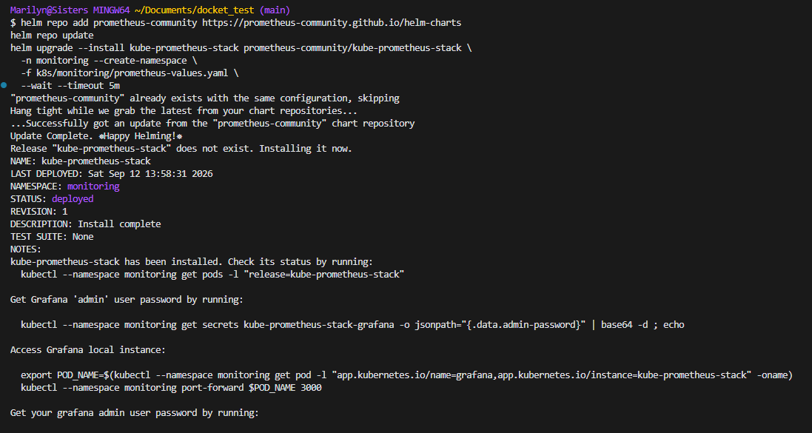

#### Conectar la app con ServiceMonitor

```bash
kubectl apply -f k8s/monitoring/servicemonitor.yaml
```
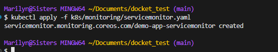

#### Validar en Prometheus

```bash
kubectl port-forward -n monitoring svc/kube-prometheus-stack-prometheus 19090:9090
```

> Si el puerto `9090` está ocupado localmente, usar `19090` como puerto alternativo.

Abrir en el navegador:

```text
http://localhost:19090/targets
```
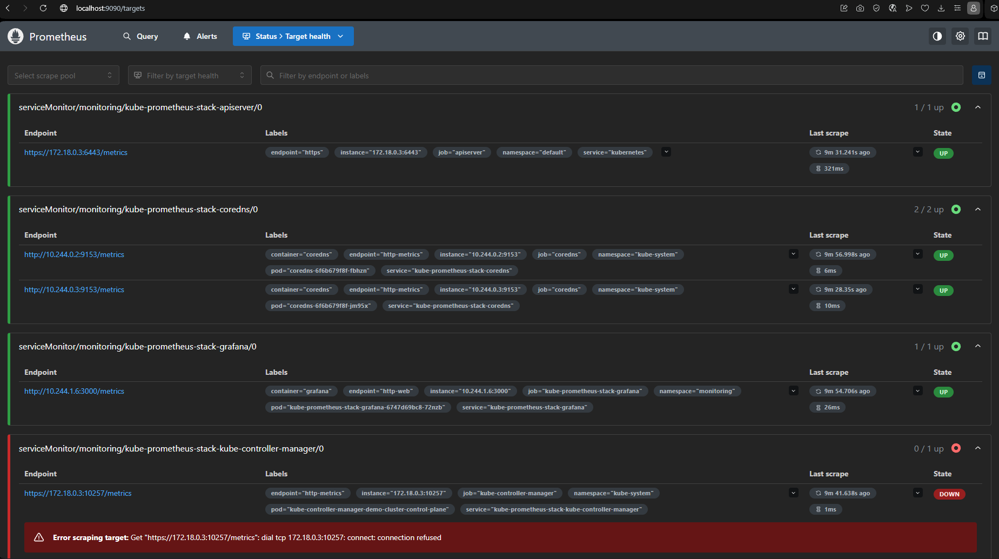

Debe aparecer el servicio `demo-app-servicemonitor` con estado UP.

#### Abrir Grafana

```bash
kubectl port-forward -n monitoring svc/kube-prometheus-stack-grafana 3001:80
```

> Si el puerto `3000` ya está en uso, usar `3001` como puerto alternativo.

Usuario y contraseña:

```text
usuario: admin
password: admin123
```

Luego abrir Grafana en:

```text
http://localhost:3001
```

Y luego importar el dashboard:

- Dashboards → New → Import
- cargar [k8s/monitoring/grafana-dashboard-app.json](k8s/monitoring/grafana-dashboard-app.json)


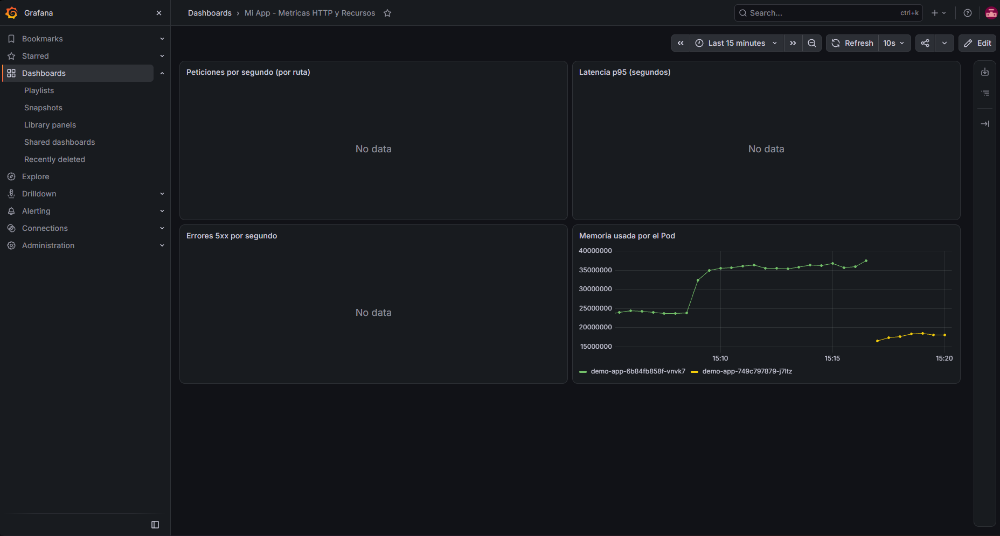


---
## 9. FinOps: autoescalado y apagado de recursos


### 9.1 Requests y limits

Se agregaron `resources.requests` y `resources.limits` al contenedor de la app en:

- [k8s/01-deployment.yaml](k8s/01-deployment.yaml)

Esto permite:

- dimensionar el consumo real del pod
- permitir que el HPA tome decisiones con base en CPU
- evitar que un contenedor consuma memoria o CPU sin límite

### 9.2 Autoescalado con HPA

El manifiesto quedó en:

- [k8s/finops/hpa.yaml](k8s/finops/hpa.yaml)

Aplicarlo:

```bash
kubectl apply -f k8s/finops/hpa.yaml
kubectl get hpa -n demo
```
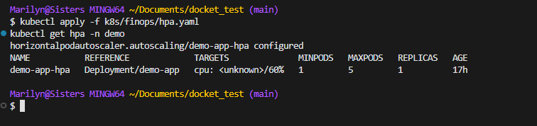 
### 9.3 Apagado programado fuera de horario

Se creó el cronjob para escalar a 0 réplicas fuera de horario y volver a subir la app en la mañana en:

- [k8s/finops/scale-down-cronjob.yaml](k8s/finops/scale-down-cronjob.yaml)

Aplicarlo:

```bash
kubectl apply -f k8s/finops/scale-down-cronjob.yaml
kubectl get cronjobs -n demo
```
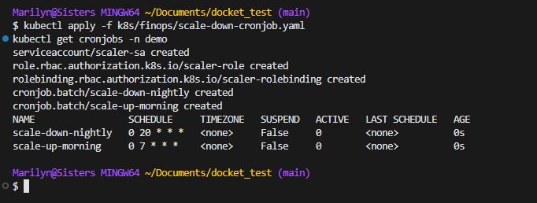

Prueba rápida manual:

```bash
kubectl create job --from=cronjob/scale-down-nightly demo-1 -n demo
kubectl get pods -n demo -w
kubectl create job --from=cronjob/scale-up-morning demo-2 -n demo
```
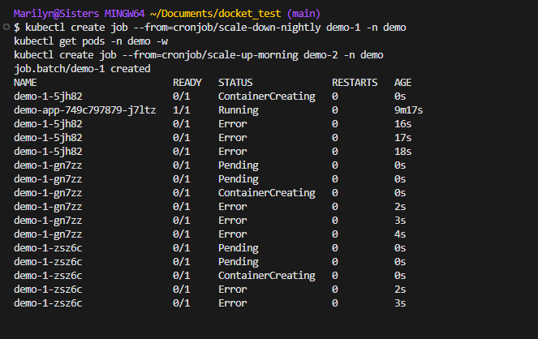

### 9.4 Limpieza automática de imágenes GHCR

Para cerrar el ciclo de FinOps de almacenamiento, se agregó el workflow:

- [.github/workflows/ghcr-cleanup.yml](.github/workflows/ghcr-cleanup.yml)

Este elimina versiones antiguas del paquete de GHCR conservando las últimas 5, reduciendo costo de almacenamiento.

---
## 10. GitHub Actions

Los workflows actuales están en:

- [.github/workflows/ci.yml](.github/workflows/ci.yml)
- [.github/workflows/cd.yml](.github/workflows/cd.yml)

### 10.1 Qué hace el pipeline CI

- checkout del repositorio
- setup de Node.js
- instalación de dependencias
- ejecución de tests
- build de la aplicación
- análisis SAST con Trivy

### 10.2 Qué hace el pipeline CD

Su propósito es validar que:

- Terraform queda inicializado correctamente
- la infraestructura se puede validar con `terraform validate`
- el formato de Terraform es correcto
- los manifiestos de Kubernetes son válidos con `kubectl apply --dry-run=client`
- la imagen es buildada y publicada en GHCR
- la app se despliega en el cluster
- se ejecuta una validación DAST con OWASP ZAP

### 10.3 Ejecutar manualmente el workflow

Desde GitHub:

1. ir a la pestaña Actions
2. seleccionar el workflow `CD` o `CI`
3. hacer click en `Run workflow`
4. confirmar la ejecución

Captura de CI

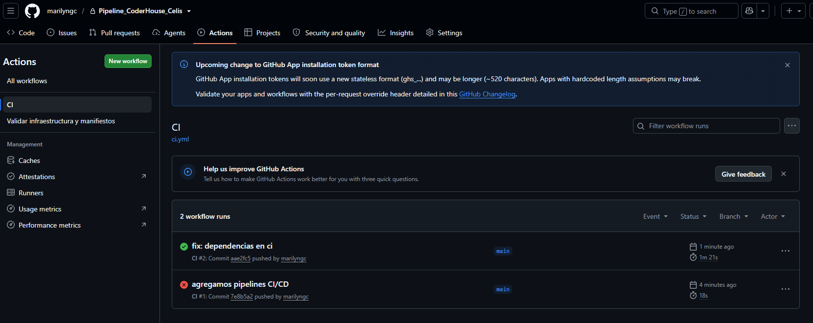

Captura de CD

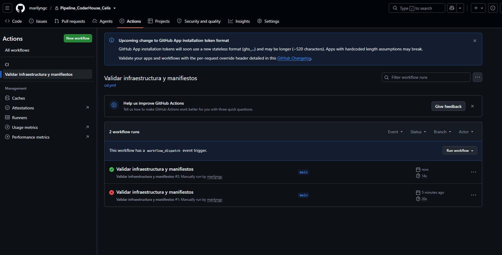

---
